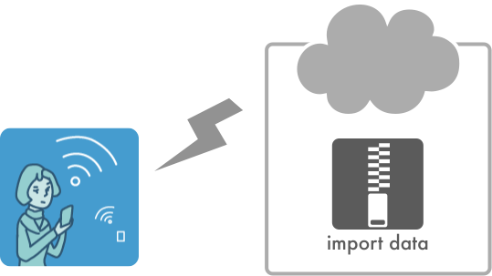

#BeaconWorkshopインポートデータ仕様

## 1. 概要
ビーコンワークショップ(以下、BeaconWorkshop)は iBeacon を利用するコンテンツ表示システムのプロトタイプを作ることができるiOSアプリです。ユーザーが作成したコンテンツをインポートして使用できることを特徴としており、次のようなカスタマイズが可能です。

* 表示するコンテンツの変更
* 監視するビーコン領域の指定
* ビーコン領域と表示コンテンツの対応付け

コンテンツに含まれるファイルは設定ファイルとガイドコンテンツファイルに分類できます。設定ファイルはプロパティリストと呼ばれるXMLベースのテキストファイルで記述されます。表示コンテンツファイルは一般的なWebページであり、HTMLファイルとそれにリンクする画像ファイルやCSSファイル等を含みます。




これらのコンテンツ群をZIPアーカイブしたものがインポートデータ本体になります。作成したインポートデータをクラウドストレージに置くことによりアプリから取り込んで利用することができます。

## 2. インポートデータで扱うファイル

はじめにインポートデータで扱うファイルの形式について説明します。

* #### プロパティリスト
プロパティリスト(Property List：以下 plist)は、OS XやiOSにおいてデータを格納するために用いられるファイル形式のひとつで、アップルにより[DTD](http://www.apple.com/DTDs/PropertyList-1.0.dtd)が定義されているXML形式のファイルです。BeaconWorkshopではビーコン情報やコンテンツ情報をカスタマイズする目的で使用します。plistファイルはXcodeに統合されたプロパティリストエディタで編集できるほか、一般的なテキストエディタでも編集可能です。(Windows環境でも動くplistエディタもいくつか存在するようです)
* #### HTMLコンテンツ
BeaconWorkshopで表示する情報はHTMLとしてマークアップされたファイルと、その関連ファイルです。アプリ内ではこのHTMLコンテンツをWebビューで表示するため、iPhoneやiPadのMobile Safariと同等の表示が可能です。ビーコン画像の表示制御等にはCSSを利用します。


## 3. インポートデータを構成するファイル

インポートデータを構成するファイルについて説明します。

### 3.1 コンテンツアーカイブ
コンテンツアーカイブはコンテンツファイル群をZIPアーカイブしたものです。
コンテンツファイル群は **GuideContents** という名称のフォルダに入れる必要があり、コンテンツアーカイブはこの **“フォルダ構成を保ったままアーカイブ”** する必要があります。

コンテンツアーカイブは以下のようなファイルで構成されます。


表 3-1. インポートデータのファイル種別

| ファイル種別 | 内容 |
|---|---|
| [コンテンツ情報定義ファイル](#settings) | インポートデータの基本情報を定義する |
| [ビーコン領域定義ファイル](#regions) | 監視するビーコン領域を定義する |
| [表示コンテンツ定義ファイル](#guides) | 表示するコンテンツに付随する情報、およびビーコン領域との対応付けを定義する |
| コンテンツHTMLファイル | 表示されるHTMLファイル |
| コンプリート画面HTMLファイル | すべてのビーコン領域に入った際に一度だけ表示される特殊なHTMLファイル |
| 画像ファイル | HTMLで使用される画像リソース |
| CSSファイル | HTMLで使用されるスタイルシート。ビーコン画像の表示制御にも使用する。 |
| HTMLで利用するその他リソースファイル | 動画や音声データ、JavaScriptファイル等、HTMLファイルに関連するリソースなど |

### <a name="folder_structure"></a>3.2 コンテンツのファイル構成
GuideContentsフォルダ以下に関連ファイルを格納します。

TODO: plistとかhtmlは自由におけるかどうかの説明

#### 3.2.1 フォルダ分けしない場合のファイル構成
ファイル数が少ない場合などはGuideContentsフォルダ以下にすべてのファイルを置いても良いでしょう。

```
GuideContents
├ settings.plist
├ regions.plist
├ guides.plist
├ index.html
├ completed.html
├ 個別の表示HTMLファイル
├ 画像ファイル
└ CSSファイル
```

#### 3.2.2 フォルダ分けする場合のファイル構成
ファイル数が多い場合などは、個別HTMLファイル、画像、cssなどを任意のフォルダに置いたほうがファイル管理がしやすくなります。htmlやCSSファイル内では相対パスでファイル指定します。

```
GuideContents
├ settings.plist
├ regions.plist
├ guides.plist
├ index.html
├ completed.html
├ contentsフォルダ
│  └ 個別の表示HTMLファイル
├ imgフォルダ
│  └ 画像ファイル
└ cssフォルダ
   └ CSSファイル
```

### <a name="settings"></a>3.3 コンテンツ情報定義ファイル
コンテンツ情報定義ファイルは、インポートデータの基本情報を定義するplistファイルです。  
ファイル名は固定で settings.plist を使用します。

以下のKey-Value情報を辞書に格納します。

| Key | Type | Default Value | Requirement | 説明 |
|---|:---:|:---:|:-:|
| Beacon UUID| String | 65128774-D16C-4DC5-BF52-E1ECF4CF9C87| optional | 監視するビーコンのUUID (全ビーコン共通) |
|Beacon configuration file| String | regions.plist | optional | ビーコン領域定義ファイルのplist名(拡張子なし) |
|Contents configuration file| String | guides.plist | optional | 表示コンテンツ定義ファイルのplist名(拡張子なし) |
|Main map HTML file| String | index.html | optional | メインマップ画面のHTMLファイル名(拡張子なし) |
|Completed HTML file| String | completed.html | optional | コンプリート画面のHTMLファイル名(拡張子なし)|

####定義例
デフォルト設定の settings.plist ファイルは以下のように定義されるでしょう。

```xml
<?xml version="1.0" encoding="UTF-8"?>
<!DOCTYPE plist PUBLIC "-//Apple//DTD PLIST 1.0//EN" "http://www.apple.com/DTDs/PropertyList-1.0.dtd">
<plist version="1.0">
<dict>
	<key>Beacon UUID</key>
	<string>65128774-D16C–4DC5-BF52-E1ECF4CF9C87</string>
	<key>Contents configuration file</key>
	<string>guides.plist</string>
	<key>Beacon configuration file</key>
	<string>regions.plist</string>
	<key>Main map HTML file</key>
	<string>index.html</string>
	<key>Completed HTML file</key>
	<string>completed.html</string>
</dict>
</plist>
```

### <a name="regions"></a>3.4 ビーコン領域定義ファイル
ビーコン領域定義ファイルでは監視するビーコン領域を登録するためのplistファイルです。
ファイル名はコンテンツ情報定義ファイルで指定したBeacon Settings plist nameキーの値に拡張子plistを付加したものになります(未定義ならデフォルトの regions.plist が使われます)。

以下のビーコン領域定義の辞書要素を監視領域の数だけ配列として持ちます。

| Key | Type | Default Value | Requirement | 説明 |
|---|:---:|:---:|:-:|
| identifier | String | なし | required | ビーコン領域の識別子。このファイル内において他の領域のidentifierと重複しないユニークな文字列。 |
| major | Number | なし | required | 監視するビーコン領域のmajor番号 |
| major | Number | なし | required | 監視するビーコン領域のminor番号 |

####定義例
以下のようなidentifier, major, minor 情報を持つ２つのビーコン領域が定義されたplistの記述例を示します。

| identifier | major | minor |
|:-:|:-:|:-:|
| 1 | 1 | 1 |
| 2 | 1 | 2 |


```xml
<?xml version="1.0" encoding="UTF-8"?>
<!DOCTYPE plist PUBLIC "-//Apple//DTD PLIST 1.0//EN" "http://www.apple.com/DTDs/PropertyList-1.0.dtd">
<plist version="1.0">
<array>
	<dict>
		<key>identifier</key>
		<string>1</string>
		<key>major</key>
		<integer>1</integer>
		<key>minor</key>
		<integer>1</integer>
	</dict>
	<dict>
		<key>identifier</key>
		<string>2</string>
		<key>major</key>
		<integer>1</integer>
		<key>minor</key>
		<integer>2</integer>
	</dict>
</array>
</plist>
```

配列(array)の要素に辞書(dict)が格納されます。

### <a name="guides"></a>3.5 表示コンテンツ定義ファイル
表示コンテンツ定義ファイルは、ビーコンに反応した際に表示するコンテンツの情報を定義したplistファイルです。
ファイル名はコンテンツ情報定義ファイルで指定したContents plist nameキーの値に拡張子plistを付加したものになります(未定義ならデフォルトの guides.plist が使われます)。

以下の表示コンテンツ定義の辞書要素を監視領域の数だけ配列として持ちます。

| Key | Type | Default Value | Requirement | 説明 |
|---|:---:|:---:|:-:|
| Region identifier | String | なし | required | 反応させるビーコン領域の識別子 (ビーコン領域定義ファイルのidentifierキー)。このファイル内において他のコンテンツの識別子と重複しないこと。 |
| Title | String | なし | optional | ビーコン領域を表す文字列。ナビゲーションバーに表示される。 |
| Content URL | String | なし | optional | ビーコンに反応して表示されるコンテンツのURL。settings.plistのあるディレクトリからの相対パスで指定する。リモートのURLも指定可能。 |
| Speech text | String | なし | optional | Content URLキーで指定したコンテンツが表示されたときにTTSエンジンが読み上げるテキスト |

####定義例
以下のような値を持つ２つのコンテンツ情報が定義されたplistの記述例を示します。

| Region identifier | Title | Content URL | Speech text |
|:-:|:-:|:-:|:-:|
| 1 | ビーコン１ | region1.html | なし |
| 2 | ビーコン２ | region2.html | なし |

```xml
<?xml version="1.0" encoding="UTF-8"?>
<!DOCTYPE plist PUBLIC "-//Apple//DTD PLIST 1.0//EN" "http://www.apple.com/DTDs/PropertyList-1.0.dtd">
<plist version="1.0">
<array>
	<dict>
		<key>Region identifier</key>
		<string>1</string>
		<key>Title</key>
		<string>ビーコン１</string>
		<key>Content URL</key>
		<string>region1.html</string>
	</dict>
	<dict>
		<key>Region identifier</key>
		<string>2</string>
		<key>Title</key>
		<string>ビーコン２</string>
		<key>Content URL</key>
		<string>region2.html</string>
	</dict>
</array>
</plist>
```

配列(array)の要素に辞書(dict)が格納されます。


## 4. HTMLコンテンツ
BeaconWorkshopでは表示するコンテンツをHTMLで記述します。表示のされ方や制限などはMobile Safariに準じます。iPhone/iPadの解像度の違いや、デバイスの向き(縦横)が変わった場合のサイズ調整などはHTML側の責務となります。

### 4.1 ビーコンとコンテンツの対応づけ

ユーザーがビーコンに紐づいた表示コンテンツを表示する手段は２つあります。ひとつは表示コンテンツに紐づいたビーコン領域に入る行為、もうひとつはメインHTML上のビーコンアイコンなどに設定されているアンカーをタップする行為です。

これらの動作と表示されるコンテンツとの関係には以下の原則があります。

* ビーコンに反応してコンテンツが自動表示される場合、表示コンテンツ定義ファイルのContent URLキーに指定されたコンテンツが表示される(HTMLファイルのアンカー記述とは無関係)
* ユーザーがメインマップ画面のビーコン画像を押下してコンテンツを表示する場合は、メインマップ画面のHTML内アンカーの記述通りに表示される

### 4.2 メインマップ画面のHTMLコンテンツ
メインマップ画面に表示するコンテンツはHTMLファイルです。見た目は地図のような表示形式に限らず、HTMLで自由に表現できます。このHTML内にビーコン情報に紐づいたアイコンを表示することにより、ユーザーにビーコン領域内・領域外にいることや訪問済みであるといった情報を伝えることができます。

#### 4.2.1 個別HTMLコンテンツへのリンク
メインマップ画面のHTMLから個別のHTMLコンテンツに画面遷移するにはアンカータグ(aタグ)でリンクを作成します。アンカータグのid属性にRegion identifier(表示コンテンツ定義ファイル)を指定すると表示コンテンツ定義に紐づいたビーコンとの表示連携が行えるようになります([後述](#interlockBeacon))。

アンカータグで画面遷移を行う定義例:

```
<a href="hoge.html" id="101">ほげ</a>
```

#### 4.2.2 定義済みCSSクラス
ビーコン領域に紐づけたHTML要素の見た目を制御するためのBeaconWorkshop独自のCSSクラスが定義されています。CSSでこれらのスタイルを定義することにより外観をカスタマイズできます。

| クラス名 | 説明 |
|---|---|
| within-region | ビーコン領域内にいる |
| out-of-region | ビーコン領域外にいる |
| visited | ビーコン領域に一度でも訪れた |

例: Region identifier が 101 の定義済みビーコン領域に入った場合のclass属性

```
<a href="1-101.html" id="101" class="within-region visited"></a>
```

ビーコン領域に入った(出た)場合に、ビーコン領域に対応するid属性をもつ要素に対してこれらのクラスを動的に付加(削除)します。この処理は以下の手順で行われます。

1. ビーコン領域に入った(出た)
2. ビーコン領域定義ファイルから一致する領域の定義情報を探す  
3. 見つかった定義情報のidentifierをid属性にもつhtml要素を探す
4. 見つかったhtml要素にクラスを付加(削除)する


#### <a name="interlockBeacon"></a>4.2.3 ビーコン画像と個別HTMLコンテンツの対応付け
ビーコン画像を表示する場合はアンカータグの背景画像として設定するとよいでしょう。  
以下はビーコン画像の見た目を制御するCSSと、スタイルを適用したアンカータグの記述例です。

```
@-webkit-keyframes anim {
  0% { opacity: 1; }
  50% { opacity: 0; }
  100% { opacity: 1; }
}

.beacon {
  background-image: url(images/beacon-off.png);
  width: 32px;
  height: 32px;
  display:block;
}

.within-region  {
  background-image: url(images/beacon-on.png);
  -webkit-animation: anim 1s infinite;
}

.out-of-region  {
  background-image: url(images/beacon-off.png);
}

.visited
{
  background-image: url(images/beacon-on.png);
}

.region1 {
  position: absolute;
  left: 288px;
  top: 380px;
}
```

```
<a href="1-101.html" id="101" class="beacon region1"></a>
```

この例ではビーコン画像(beacon-off.png)が絶対座標(288, 380)の位置に表示されます。対応するビーコン領域に入った場合、ビーコン画像(beacon-on.png)が点滅アニメーションを行い、領域から出ると点滅が止まります。

### 4.3 個別のHTMLコンテンツ
個々のHTMLコンテンツの表示や制限はMobile Safariに準じます。
ウェブリンクも可能ですが前ページに戻る等のナビゲーションはできないので注意してください。
