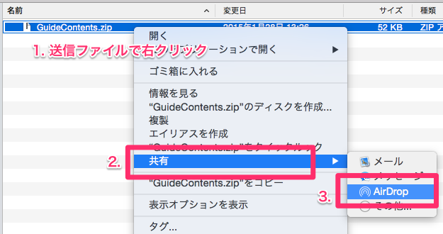
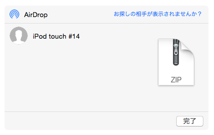
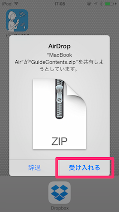
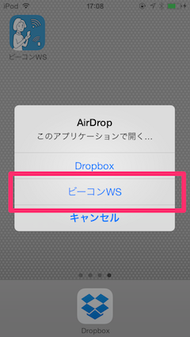
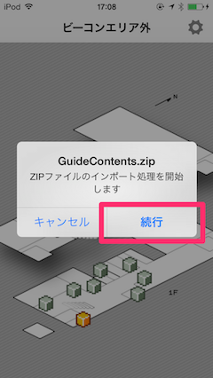
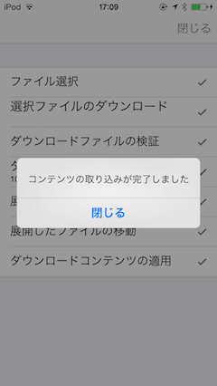

#BeaconWorkshopマニュアル

##1. ビーコンワークショップアプリについて
「ビーコンワークショップアプリ」(以下、BeaconWorkshop)は iBeacon(※) を利用したコンテンツ表示システムのプロトタイプを作ることができ、iOS端末で利用可能です。ユーザーが作成したコンテンツをインポートして使用できることを特徴としており、簡易的な館内ナビゲーションやスタンプラリーのようなコンテンツを作ることができます。

※ iBeaconは、Apple Inc.の登録商標です。 [" iOS：iBeacon について " - Apple Inc.] (http://support.apple.com/kb/HT6048?viewlocale=ja_JP&locale=en_US)

#####App Storeリンク
- [ビーコンワークショップ](https://itunes.apple.com/jp/app/bikonwakushoppu/id908171923?mt=8)
- [ビーコンワークショップLite](https://itunes.apple.com/jp/app/bikonwakushoppu-lite/id908172593?mt=8)

###1.1 できること
* ビーコン領域に入ったらコンテンツを表示する
* すべてのビーコン領域を訪問したときにコンテンツを表示する
* 独自の表示コンテンツやビーコン情報を使用する

###1.2 できないこと
* ビーコン領域に出入りした際のPush通知
* バックグラウンド状態でのビーコン領域の検出
* ユーザーロケーションのマップ画面上への表示

###1.3 動作環境
* Bluetooth 4.0に対応したiOS端末  
  iPhone 4s 以降, iPad (3rd generation) 以降, iPad mini 以降, iPod touch (5th generation) 以降
* iOS 7.1以上
* AirDropを利用する場合は[Appleのサポートサイト](http://support.apple.com/ja-jp/HT6510)にあるシステム条件を満たしたMacが必要です

###1.4 用意するもの
* iBeaconのビーコン信号を放出する装置(各社iBeaconビーコン端末、iOSアプリなど)
* [Dropboxアカウント](https://www.dropbox.com/ja/) (外部データの取り込み時に必要)
* [Dropbox公式アプリ](https://itunes.apple.com/jp/app/dropbox/id327630330?mt=8) (外部データの取り込み時に必要)

###1.5 Lite版と有料版の違い
Lite版アプリでは以下のように監視できるビーコン領域の数に制限があります。ビーコン領域の定義数に制限はありませんが、ビーコンに反応して表示できるコンテンツ数が３つに制限されます。

|機能| Lite版 | 有料版 |
|---|:---:|:---:|
| 監視ビーコン領域数|3個|無制限|

上記以外に機能の違いはありません。

##2. アプリの使い方

###2.1 画面の説明

- **2.1.1 メインマップ画面**  
  
メインマップ画面は主にビーコンの物理的な位置関係をあらわすために使われます。マップ上にはビーコン位置を示すアイコンが配置されます。ビーコンに反応して見た目が変化したり、ビーコンアイコンをタップすることで後述の個別コンテンツ画面に遷移したりできます。

- **2.1.2 個別コンテンツ画面**  
  
個別コンテンツ画面は、ビーコンに反応して表示されるコンテンツです。ビーコンが置かれた場所の情報を表示できます。ビーコン毎に表示するコンテンツを変えることができます。メインマップ画面からユーザー操作で表示することもできます。

- **2.1.3 設定画面**  
  
設定画面はアプリの動作を変更したり、外部コンテンツを取り込んだりできます。

###2.2 設定画面詳細
####2.2.1 ビーコン検出設定  
ビーコン検出設定セクションではビーコンを検出してコンテンツを表示する際のビーコンの検出アルゴリズムを変更できます。BeaconWorkshopでは、以下の**検出距離**と**検出方法**の設定を組み合わせてビーコン検出の動作を変更します。

- **検出距離**  
検出距離設定では「ビーコンを検出するのに必要な距離」を変更できます。  
**"とても近い"**は、ビーコンにタッチしてコンテンツを表示するような場合や、ビーコン同士の設置距離がかなり近いような利用場面に適しています。  
***"遠い"**は広い場所で遠くからでもビーコン検出させたり、障害物が多くビーコンの電波が届きにくい場合などに適しています。

- **検出方法**  
検出方法設定ではビーコンの検出のしかたを変更できます。この設定を変えると、ビーコンに近づいてから個別コンテンツが表示されるまでの時間が変化します。  
**"速度優先"**はビーコンを見つけたらすぐにコンテンツを表示しますが、複数のビーコンが同じくらいの距離に置かれている場合などに誤検知が発生しやすくなります。  
**"精度優先"**は同じビーコンの電波を繰り返し検出したことを確認してからコンテンツ表示を行うため誤検知が少なくなりますが、検出に時間がかかります。  
**"標準"**は、速度優先と精度優先双方の特徴をあわせ持ちます。

####2.2.2 アクティビティ
アクティビティセクションはユーザーの活動状態や行動履歴に関連する操作を行います。

- **行動履歴のクリア**  
BeaconWorkshopではビーコンに立ち寄ったか否かの情報を記憶してスタンプラリー的に使用することができますが、"行動履歴のクリア"を行うことにより全てのビーコンを未訪問状態に戻すことができます。

####2.2.3 コンテンツ
コンテンツセクションではユーザー定義のコンテンツを取り込んだり、削除したりする機能を提供します。

- **外部コンテンツの取り込み**  
外部コンテンツの取り込みではDropbox上に置かれた独自コンテンツ(コンテンツアーカイブ)を取り込んでアプリ内の表示コンテンツを差し替える機能です。   
作成したコンテンツアーカイブを選択すると自動的に取り込み処理とコンテンツの適用が行われます。コンテンツの内容に不備がある場合は、エラーを表示して取り込み処理を中止します。  
本機能を利用するために、事前に[Dropboxアカウント](https://www.dropbox.com/ja/)の登録を行い(既にアカウントがある場合は不要)、[Dropboxアプリ](https://itunes.apple.com/jp/app/dropbox/id327630330?mt=8)を端末にインストールしておく必要があります。

- **ダウンロードコンテンツの削除**  
ダウンロードして適用した独自コンテンツを削除して、アプリの初期コンテンツに戻します。

##3. ユーザー定義データについて

作成した表示コンテンツを取り込んで使用することができます。
データを作成するにあたり下記についての知識が必要となります。

* HTML
* CSS
* JavaScript(必要であれば)

###3.1 ユーザー定義データの使用方法
以下の手順で表示コンテンツを入れ替えることができます。

1. コンテンツデータを作成する
2. コンテンツデータアーカイブをDropboxにアップロードする
3. BeaconWorkshopからコンテンツデータアーカイブを取り込む

アプリバージョン 1.1.0 からAirDropでコンテンツアーカイブを転送し、取り込むことができるようになりました。AirDropを利用した場合の表示コンテンツ入れ替え手順は以下のようになります。

1. コンテンツデータを作成する
2. コンテンツデータアーカイブをAirDropでBeaconWorkshopに転送する
3. BeaconWorkshop側でファイルを受け入れると取り込みが開始する

###3.2 ユーザー定義データ作成の手順
ユーザー定義データを一から作成する場合は以下のような手順で行いますが、手順1〜4についてはテンプレートファイルをもとに拡張する方法を推奨します。

1. コンテンツ設定ファイル(settings.plist / .json)を作成・編集する
2. ビーコン情報を登録する
3. コンテンツ情報を登録する
4. HTMLコンテンツを作成する
5. データをアーカイブしてDropboxにアップロードする  
AirDropを利用する場合は、アーカイブをiOS端末に転送する

テンプレートファイルは本リポジトリのGuideContentsディレクトリ以下のファイル群です。

####3.2.1 コンテンツアーカイブの作成
作成したコンテンツデータはZIP形式で圧縮することでコンテンツアーカイブとなります。圧縮する際に、**GuideContentsフォルダ自体を圧縮する必要がある**点に注意してください(下図参照)。GuideConetntsフォルダの名前は変更してはなりません。

圧縮するとGuideContents.zipという名前のファイルが作成されます(同名のファイルが存在する場合はファイル名のうしろに数字が付加されます)。これが**コンテンツアーカイブ**です。コンテンツアーカイブの名前はわかりやすいように変更しても構いません(例: hogehoge-contents.zip)。

####3.2.2 コンテンツアーカイブのアップロードと取り込み
ZIP圧縮されたコンテンツアーカイブをBeaconWorkshopで取り込むまでの手順を説明します。Dropboxを利用する場合とAirDropを利用する場合とで操作方法が異なるため、利用環境にあわせて読み進めてください。

#####3.2.2.1 コンテンツアーカイブのアップロードと取り込み(Dropbox利用)
1. Dropboxを利用する場合は、WebブラウザでDropboxにサインインし、ファイル一覧画面にコンテンツアーカイブをドラッグ＆ドロップすることでアップロードが実行されます。

2. DropboxにアップロードしたコンテンツをBeaconWorkshopに取り込むために、設定画面の [外部コンテンツ取り込み] 機能を選択します
3. 端末内のDropboxアプリが起動してファイル一覧が表示されます。ファイル一覧からアップロードしたコンテンツアーカイブを選択します。  
※ このとき、Dropboxアプリがインストールされていない場合はインストールを促す画面が表示されます。Dropboxアプリインストールとアカウントを設定しておきます
4. BeaconWorkshopでコンテンツアーカイブの取り込みが開始します
5. 取り込みが完了したら [Back] ボタンを押して取り込み画面を閉じます

#####3.2.2.2 コンテンツアーカイブの転送(AirDrop利用)
___AirDropを利用する場合は[Appleのサポートサイト](http://support.apple.com/ja-jp/HT6510)にあるシステム条件を満たしたMacが必要です。___

1. MacのFinderからコンテンツアーカイブを選択して右クリックメニューを表示し、[共有] > [AirDrop] を選択したのち、共有先のiOS端末を選択します  
  

3. 次の画面が表示された場合、[受け入れる]を選択します。この画面は、転送先のiOS端末が転送者自身のものではない(iCloud情報がMac側と同じでない等)場合に表示されるようです。  

4. ZIPファイルの受け入れが可能なアプリが複数ある場合は、アプリ一覧から [ビーコンWS] を選択します。BeaconWorkshopが起動していない場合は自動的に起動します。  

5. ZIPファイルインポートの確認アラートが表示されたら、[続行] を選択します。  

6. BeaconWorkshopでコンテンツアーカイブの取り込みが開始します
7. 取り込みが完了したら [閉じる] ボタンを押して取り込み画面を閉じます

